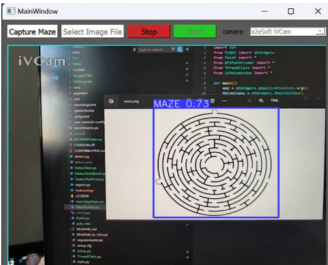
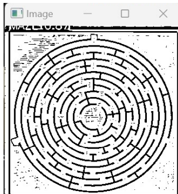
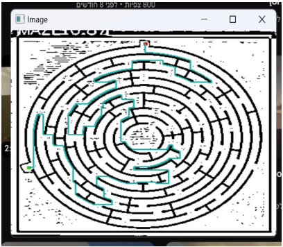
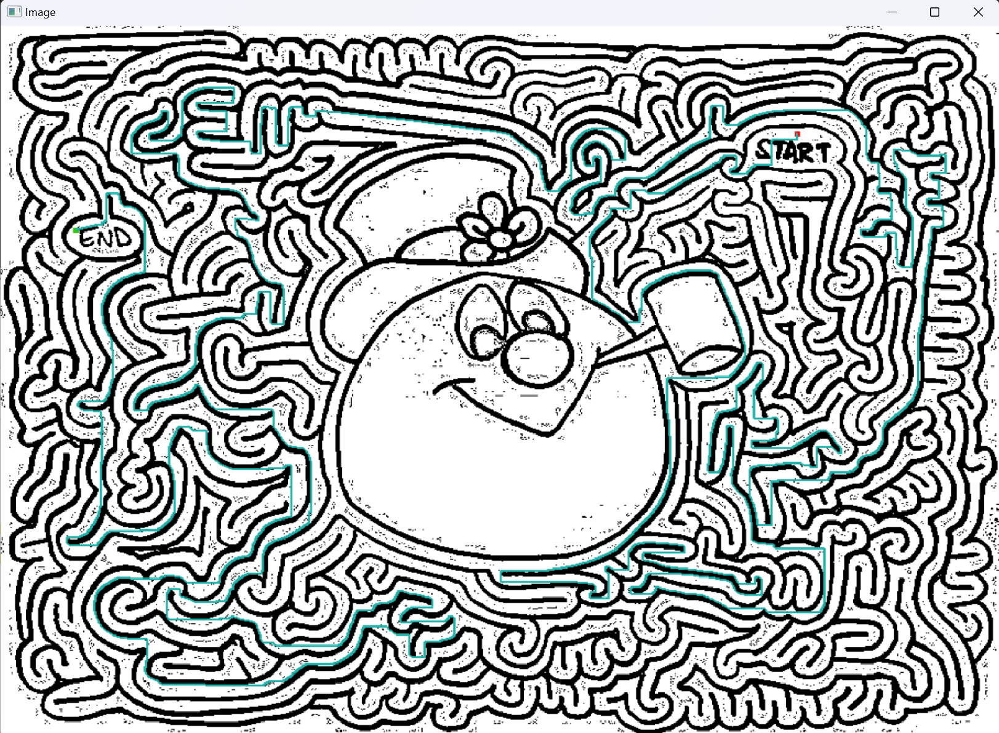

# Maze-Solver-BFS
Python based application that detects and solves mazes using a trained neural network model and the Breadth First Search (BFS) algorithm. The project integrates several libraries such as OpenCV, PyTorch, NumPy, PyQt5, and Tkinter to provide a comprehensive solution from image acquisition to pathfinding.

Demonstration: [YouTube Video](https://www.youtube.com/)

 

 
 

Tested using `Python 3.10.5` (newer versions may or may not work)

# Key Features:

YOLOv5 Integration: Utilizes a custom-trained model to detect mazes in input images.
Image Processing with OpenCV: Manipulates and enhances maze images for better user interaction.
Pathfinding with BFS: Implements the BFS algorithm to find the shortest path in the maze.
User Interface: Provides an intuitive UI for image capture/upload, start/end point marking, and displaying the solution path.


Technologies Used:

- `Python 3.10.5`
- `OpenCV-python`: 4.8.0.76
- `Torch`: 2.0.1
- `Torchvision`: 0.15.2
- `Ultralytics`: 8.1.19
- `seaborn`: 0.12.2
- `NumPy`: 1.23.5
- `PyQt5`: 5.15.9
- `Tkinter`

# Installation and Setup:

1. Clone the repository:
```bash
git clone https://github.com/RaphaelChalupowicz/Maze-Solver-BFS.git
```
2. Navigate to the project directory:
```bash
cd Maze-Solver-BFS
```
3. Install the required dependencies:
```bash
pip install -r requirements.txt
```

# Usage:

1. Run the application:
```bash
python MazeSolver.py
```
